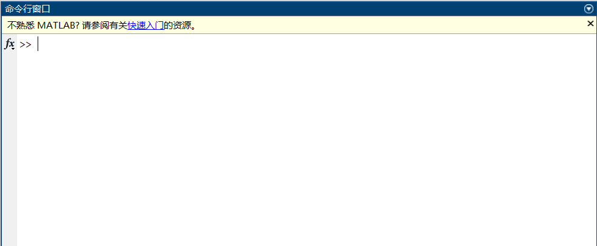
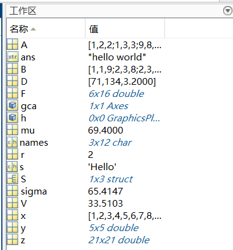

# MATLAB 命令行和工作区

## MATLAB 命令行介绍

MATLAB 命令行需要在下图 MATLAB 窗口中使用：

在`>>`后面键入命令：`>> "hello world"`，非常容易地，我们完成了第一个命令行

而 MATLAB 的一项区别于 C/C++ 语言的特点是，它是一种脚本语言，这意味着在 MATLAB 命令行中也可以进行一系列诸如变量创建，函数调用等操作

## MATLAB 工作区介绍

我们利用命令行创建的变量都会在工作区中中展示

事实上这些变量
