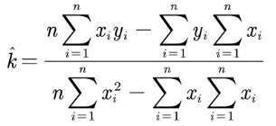
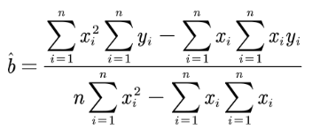

#! https://zhuanlan.zhihu.com/p/546437540
# 数据拟合（Data Fitting）算法

## （一）GUIDANCE

### 1.1 什么是数据拟合

已知一组（二维）数据，即平面上的 $n$ 个点 $(x_i,y_i),\quad \forall i = 1,2,\cdots,n $， $x_i$ 互不相同，寻求一个函数（曲线） $f(x)$ ，使得 $f(x)$ 在某种意义（准则）下与所有的数据点最为接近，这个过程就是**数据拟合**

### 1.2 曲线拟合的线性最小二乘法

一般情况下，我们指的“准则”就是线性最小二乘法，线性最小二乘法是解决曲线拟合最常用的方法

> 本文的符号中，字母上加 ^ 符号表示拟合值

我们假设通过拟合得到的线性函数是：$\widehat{y_i} = \widehat{k}x_i+\widehat{b}$

那么经过最小二乘法确定参数的方法就是：$\widehat{k},\widehat{b}=arg_{k,b}min(\sum_{i=1}^n|y_i-\widehat{y_i}|)$

经过数学推导，可以得到线性最小二乘法拟合的参数求解公式：





> 事实上，拟合的方法远不止线性拟合，这里先以线性拟合作为引子

### 1.3 数据拟合和数据插值的区别

> 这里直接粘贴写在另一篇笔记中的内容：

- 插值：求已知有限个数据点的近似函数。数模比赛中，常常需要根据已知的样本点进行数据的处理和分析，对于数据量少到不足以去分析问题，而必须生成一些合理的数据，这时我们就会考虑采用插值算法

- 拟合：已知有限个数据点，求近似函数，在样本点较少的情况下，用拟合算法拟合出来的曲线并没有插值算法得到的准确。如果样本点太多，那么插值算法得到的多项式次数过高，会造成“龙格现象”，尽管插值可以通过分段进行解决，但有时我们更希望得到一个精确的函数，因此我们倾向于使用拟合算法进行替代

> 拟合不要求过已知的数据点（插值则要求），而是按某种意义下（一般是最小二乘意义下）得到和所有点的分布最“接近”的函数
>
> 插值和拟合在使用时需要进行区分，根据不同的使用情景来确定不同的方法

## （二）拟合效果评价

我们一般依据下面三个指标来确定拟合的好坏：

### 2.1 误差平方和

误差平方和：$SSE = \sum_{i=1}^n(y_i-\widehat{y_i})^2$

根据误差平方和还能给出均方差的计算公式

$$MSE = \frac{SSE}{n} = \frac{1}{n}\sum_{i=1}^n(y_i-\widehat{y_i})^2$$

### 2.2 回归平方和

回归平方和：$SSR = \sum_{i=1}^n(\widehat{y_i}-\overline{y})^2$

### 2.3 拟合优度

总体平方和：$SST = \sum_{i=1}^n(y_i-\overline{y})^2$

不难看出会有：$SST=SSE+SSR$

我们可以用可以用拟合优度（可决系数）作为拟合好坏的评价指标：

$$
    0 \leq R^2 = \frac{SSR}{SST} = \frac{SST-SSE}{SST} \leq 1
$$

那么， $\frac{SSR}{SST}$ 越大，即 $R^2$ 越接近 $1$ ，就有误差越小，拟合效果越好 

> ATTENTION：使用这种评价标准要求参数是一次的，在设计拟合函数时应该注意

## （三）多项式拟合函数 `polyfit`

### 3.1 函数原型

- 多项式拟合函数 `coeff = polyfit(x_sample, y_sample, degree)` 

  - 第一个参数传入样本点的横坐标数组
  
  - 第二个参数传入样本点的纵坐标数组
  
  - 第三个参数传入我们需要构造的多项式的次数
  
  - 返回值 `coeff` 是多项式的系数数组

- 多项式值计算函数 `y_output = polyval(ceoff, x_input)`

  - 第一个参数传入多项式的系数数组
  
  - 第二个参数传入多项式的自变量值数组

  - 返回值 `y_output` 是多项式的因变量值数组

### 3.2 使用示例

以下代码保存在 `polyfit_test.m` 中，可前往 [GitHub 仓库下载](https://github.com/CentrifugalAI/MCM/tree/main/coding/moding_algorithm)

```m
x_sample = [1 2 3 4 5 6 7 8 9];

y_sample = [9 7 6 3 -1 2 5 7 20];

plot(x_sample, y_sample, 'bo');

hold on;

coeff = polyfit(x_sample, y_sample, 3);   %三阶多项式拟合

x_input = 0:.2:10;  

y_output = polyval(coeff, x_input);  %求对应y值

plot(x_input, y_output, 'r-');
```

> 输出结果如下，蓝色散点图表示输入样本点，红色实线表示拟合函数

<center></center>

## （四）万能模型拟合 `fit`

> 注意：在 `MATLAB` 中还有一个叫做 `ninfit` 的函数，两个函数有一定的区别，这里只介绍 `fit`
>
> `fit` 函数也是在曲线拟合工具箱 `Curve Fitting Toolbox` 中采用的函数

### 4.1 函数原型

`[fitresult, gof] = fit( xData, yData, fit_type, options );`

- 第一个参数传入样本点的自变量坐标数组
  
    > 不一定是 $x$ 轴坐标，也可以是 $x,y$ 两轴坐标合并为一个数组作为自变量，如下
    >
    > `[fitresult, gof] = fit( [xData, yData], zData, ft, 'Normalize', 'on' );`

- 第二个参数传入样本点的因变量坐标数组

- 第三个参数传入拟合函数的拟合类型，需要先用 `fittype` 函数处理，如下

    - 如果拟合类型是 `fit` 函数已经内置的类型，直接使用 `ft = fittype( 'gaussl' );    % 高斯拟合`
    - 如果拟合类型不是 `fit` 函数已经内置的类型，而是我们自己新定义的类型，那么可以如下操作
      
      ```m
         % 下面采用匿名函数的方法进行定义，但你并不需要精通掌握匿名函数的规则，只需要知道下面的格式和规则
         % 命名格式是：fittype(@(参数列表) 拟合函数形式)
         % 注意自变量必须是 x
         % 注意参数要放在自变量前面，在下面的代码中，匿名函数参数的形式为(a, b, c, x)，便遵循了这一规则
         ft = fittype(@(a, b, c, x) a*x^3 + b* x^2 + c*x );
      ```

- 第一个返回值是拟合得到的函数模型结果

- 第二个返回值是包含拟合优度信息的结构体

> 如何使用这两个返回值会在（五）中介绍，它们等价于（五）中的 `fittedmodel` 和 `goodness`

### 4.2 使用示例

以下代码保存在 `fit_test1.m` 中，可前往 [GitHub 仓库下载](https://github.com/CentrifugalAI/MCM/tree/main/coding/moding_algorithm)

```m
function [fitresult, gof] = fit_test2(x_sample, y_sample, z_sample)
%CREATEFIT(X_SAMPLE,Y_SAMPLE,Z_SAMPLE)
%  创建一个拟合。
%
%  要进行 '傅里叶拟合2' 拟合的数据:
%      X 输入: x_sample
%      Y 输入: y_sample
%      Z 输出: z_sample
%  输出:
%      fitresult: 表示拟合的拟合对象
%      gof: 带有拟合优度信息的结构体

%% 拟合: '傅里叶拟合2'。
[xData, yData, zData] = prepareSurfaceData( x_sample, y_sample, z_sample );

% 设置 fittype 和选项。
ft = 'linearinterp';

% 对数据进行模型拟合。
[fitresult, gof] = fit( [xData, yData], zData, ft, 'Normalize', 'on' );
```

> 用图窗显示结果如下

<center></center>

## （五）利用 Curve Fitting Toolbox 进行拟合

> 没有安装该应用需要提前安装：`Curve Fitting Toolbox`
>
> 这个工具箱事实上是调用了 `MATLAB` 的内置函数，并且提供了方便可视化界面和绘图操作

利用工具箱进行函数的操作非常容易，简要步骤如下：

1. 在当前工作区创建数据

```
>> x_sample = [1 2 3 4 5 6 7 8 9];
>> y_sample = [9 7 6 3 -1 2 5 7 20];
>> x_input = 0:.2:10;
```

2. 打开曲线拟合器，在曲线拟合器中选择数据（会自动在列表中呈现工作区数据以供选择）

<center></center>

3. 选择不同模型，优化拟合结果

> 该工具箱能够自动导出拟合优度，如下：

<center></center>

4. 导出拟合模型、图窗，如下：

> 下图为拟合图窗

<center></center>

> 拟合模型可以导出到工作区，然后直接作为函数调用

- 我们将模型导为 `fittedmodel` ，就能够直接在命令行中输入 `>> fittedmodel(x_input)` 进行预测，其中 `x_input` 指的是待预测数组，这个函数将输出预测得到的值 `y_output`，直接在命令行中输入 `>> fittedmodel` 也可以直接查看拟合的函数模型

- 我们将合优度导为 `goodness` ，可以直接在命令行中输入 `>> goodness` 查看拟合优度结构体字段