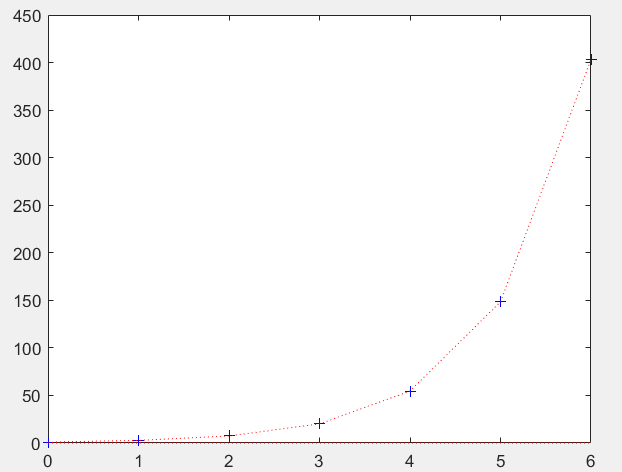

# 数据插值和拟合（DIF）

## （一）GUIDANCE

### 1.1 插值和拟合的概念

- 插值：求已知有限个数据点的近似函数。数模比赛中，常常需要根据已知的样本点进行数据的处理和分析，对于数据量少到不足以去分析问题，而必须生成一些合理的数据，这时我们就会考虑采用插值算法
  
- 拟合：已知有限个数据点，求近似函数

> 拟合不要求过已知的数据点（插值则要求），而是按某种意义下（一般是最小二乘意义下）得到和所有点的分布最“接近”的函数
>
> 插值和拟合在使用时需要进行区分，根据不同的使用情景来确定不同的方法

### 1.2 概念提示

- 被插值函数：原始函数，一系列点遵循这个原始函数来分布，被插值函数可能是不存在的，但是我们每次插值前假定所有样本点遵照这个被插值函数进行分布
  
- 插值函数：由我们根据样本点构造出来的函数，其宗旨是尽量符合被插值函数，即同时满足：完全符合已知样点分布的情况，尽量接近被插值函数中未知点的分布情况

### 1.3 插值算法的应用方法

1. 得到所有已知的样本点
   
2. 选择合适合理的插值算法
   
3. 根据这种插值算法和已知的样本点确认插值函数
   > 该笔记中使用的 `MATLAB` 函数都有统一的输入形式：第一个参数是样本点数组的 $x$ 值（数组），第二个参数是样本点数组的 $x$ 值（数组），第三个参数是插值点数组的横坐标 $x_input$（数组）
4. 根据插值函数就能够得到样本点以外的其它（我们自行构造的）数据

## （二） 插值算法原理

假设有 $n+1$ 个互不相同的节点 $(x_i,y_i),\quad \forall i = 0,1,2,\cdots,n$，其中若$i\ne j$ 则 $x_i \ne x_j$

则存在唯一的多项式：$I_n(x) = a_0 + a_1x + a_2x^2+\cdots+a_nx^n$

使得$I_n(x_j) = y_j,\quad \forall j = 0,1,2,\cdots,n$

> 根据线性代数的基本知识，我们知道过 $n+1$ 个横坐标互不相同的点能且只能确定唯一一个 $n$ 次方程
>
> 利用代数学的知识解释就是：
>
> 如果设待插值函数的 $n+1$ 个已知点为 $(x_i,y_i),\quad \forall i = 0,1,2,\cdots,n$，而插值函数 $I_n(x)$ 的所有系数看作一组代求的未知量 $(a_0,a_1,\cdots,a_n)$，那么这组未知量就是下面方程的解
>
> $$A = \begin{pmatrix} 1&x_0&\cdots&x_0^n\\ 1&x_1&\cdots&x_1^n\\ \vdots&\vdots&\ddots&\vdots\\ 1&x_n&\cdots&x_n^n \end{pmatrix} ,\quad X = (a_0,a_1,\cdots,a_n)^T,\quad Y = (y_0,y_1,\cdots,y_n)^T,\quad AX = Y$$
>
> 其中不难发现 $A$ 为范特蒙德行列式， $|A| = \prod_{i=1}^n\prod_{j=0}^{i-1}(x_i-x_j) \ne 0$ ，故根据克莱姆法则，方程有唯一解，即**在确定次数德情况下**，符合条件的方程有且只有一个

## （三） 插值算法1：分段线性插值算法

### 3.1 分段插值介绍

分段线性插值算法非常简单，就是在获得的任意两个样本点之间计算一次函数，这样就能通过 $n$ 个样本点得到 $n-1$ 段的分段一次函数，其优点就是简单明晰，运算量小，缺点是在节点不够多时可能不够精确，得到的结果也不够光滑（存在角点），即分段函数的交接处可能不具有导数

### 3.2 分段插值原理

假设有两个相邻节点 $(x_1,y_1),(x_2,y_2)$，那么在这两个相邻节点之间的一次线性方程为

$$ y = \frac{x-x_2}{x_1-x_2}y_1+\frac{x-x_1}{x_2-x_1}y_2$$

证明过程涉及初中数学，不过多解释

### 3.3 分段插值法代码

```m
function y_output = PLI(x, y, x_input) 
% Piecewise_Linear_Interpolate
% 该函数实现分段线性插值
% (x,y)为已知的数据点，这两个参数应该是长度一致的数组
% x_input为待插值的横坐标
% y_output为插值后的到的结果
 
sizex = length(x);
size_x_input = length(x_input);
y_output = zeros(size_x_input);

for j = 1 : size_x_input
    for i = 1 : sizex - 1
        if (x_input(j) > x(i) && x_input(j) <= x(i+1)) % 判断 x_input 在那个区间内
            % 在相应的区间中套用公式求出 y_output
            y_output(j) = ((x_input(j) - x(i + 1)) / (x(i) - x(i+1))) * y(i) + (((x_input(j) - x(i))/(x(i + 1) - x(i))) * y(i + 1));  
        end
    end
end
```

- 分段插值测试代码

```m
%分段线性插值测试
x = 0 : 2*pi;
y = exp(x);   % 构造一个指数模型作为被插值函数
x_input = 0:0.1:6;
y_output = PLI(x,y,x_input);
plot(x, y, 'b+', x_input, y_output, 'r:')
```

> 测试代码在 `MATLAB` 上的输出结果如下（蓝色加号是样本点，红色点线是插值点的连线）

<center></center>

## （四）插值算法2：拉格朗日多项式插值法

### 4.1 拉格朗日多项式插值法原理

如上我们已经验证如下 $n+1$ 次方程一定会有 $n+1$ 个根，分别是多项式 $I_n(x) = a_0 + a_1x + a_2x^2+\cdots+a_nx^n$ 的所有系数

$$A = \begin{pmatrix} 1&x_0&\cdots&x_0^n\\ 1&x_1&\cdots&x_1^n\\ \vdots&\vdots&\ddots&\vdots\\ 1&x_n&\cdots&x_n^n \end{pmatrix} ,\quad X = (a_0,a_1,\cdots,a_n)^T,\quad Y = (y_0,y_1,\cdots,y_n)^T,\quad AX = Y$$

根据这些信息，我们可以直接给出 $n+1$ 次方程的形式，即：

$$
    I(x) = y_1\frac{(x-x_2)(x-x_3)\cdots(x-x_n)}{(x_1-x_2)(x_1-x_3)\cdots(x_1-x_n)}+y_2\frac{(x-x_1)(x-x_3)\cdots(x-x_n)}{(x_2-x_1)(x_2-x_3)\cdots(x_2-x_n)}+\cdots+y_n\frac{(x-x_1)(x-x_2)\cdots(x-x_{n-1})}{(x_n-x_1)(x_n-x_2)\cdots(x_n-x_{n-1})}
$$

简写为：
$$
    \sum_{i=1}^ny_i\prod_{j=1,j\ne i}^n\frac{x-x_j}{x_i-x_j}
$$

> 上面这个式子就是插值多项式，这个结论只需要将所有点 $(x_i,y_i),\quad \forall i = 0,1,2,\cdots,n$ 代入验证即可，至于如何构造出的这个巧妙的式子，我们并不需要深入了解

### 4.2 拉格朗日多项式插值法代码

```m
function y_output = LI(x, y, x_input)
% 样本点数据以数组 x , y 输入，插值点以数组 input_x 输入，输出数组output_y为插值。
size_x = length(x);
size_x_input = length(x_input);
y_output = zeros(size_x_input);

for i = 1 : size_x_input
    z = x_input(i);
    s = 0.0;
    for k = 1 : size_x
        p = 1.0;
        for j = 1 : size_x
            if j ~= k
            p = p * (z - x(j))/(x(k) - x(j));
            end
        end
        s = p*y(k) + s;
    end
    y_output(i) = s;
end
```

> 直接使用分段插值的测试代码测试该函数，得到拟合的函数图像如下（蓝色加号是样本点，红色点线是插值点的连线）

<center></center>

## （五）插值算法3：牛顿插值法

### 5.1 牛顿插值法介绍

拉格朗日插值公式在插值节点发生改变时，插值公式随之就要重新计算生成。事实上，牛顿插值法和拉格朗日插值法的结果相同，但是表示形式不同，由此形成的计算思路也不相同

### 5.2 牛顿插值法原理

首先应该先定义**差商**的概念：

$$一阶差商：f[x_i,x_j] = \frac{f(x_i)-f(x_j)}{x_i-x_j}$$

$$二阶差商： f[x_i,x_j,x_k] = \frac{f[x_i,x_j]-f[x_j,x_k]}{x_i-x_k}$$ 

$$ k阶差商：f[x_0,x_1,\cdots,x_n] = \frac{f[x_0,x_1,\cdots,x_{n-1}]-f[x_1,x_2,\cdots,x_n]}{x_0-x_n} $$

在这样的定义下，可以得到插值的计算公式，假设有 $n+1$ 个样本点为 $(x_i,y_i),\quad \forall i = 0,1,2,\cdots,n$，那么有：

$$f(x) = a_0+a_1(x-x_0)+\cdots+a_n(x-x_0)(x-x_1)\cdots(x-x_{n-1})$$

$$其中\quad a_k = f[x_0,x_1,\cdots,x_k],\quad \forall k = 0,1,2,\cdots,n$$

### 5.3 牛顿插值法的优越性

**可以通过继承已经计算得到的结果实现灵活而强大的可扩展性**

比如新添加一个样本节点 $(x_{n+1},y_{n+1})$ ，对于拉格朗日插值法而言，需要重构整个式子，再计算所有结果，这势必造成大量的计算冗余和浪费

而牛顿插值法的特殊形式在于 $k$ 阶差商和 $x_{k+1}$ 毫无关系，这意味着插值计算式 $f(x) = a_0+a_1(x-x_0)+\cdots+a_n(x-x_0)(x-x_1)\cdots(x-x_{n-1})$ 的前 $n$ 项都不必改动，只需要在最后进一步计算出 $a_n$ 然后在插值计算式末尾再添加一项即可，这个方法具有很强的计算优越性

### 5.4 牛顿插值法代码

```m
function y_output = NI(x, y, x_input)
x_size = length(x);
x_input_size = length(x_input);
dqTable = zeros(x_size,x_size);

%% 对差商表第一列赋值
for k = 1 : x_size      
    dqTable(k) = y(k);
end

%% 求差商表
for i = 2 : x_size       % 差商表从0阶开始,矩阵从1维开始存储
    for k = i : x_size
        dqTable(k, i) = (dqTable(k, i-1) - dqTable(k-1, i-1)) / (x(k) - x(k + 1 - i));  
    end
end
disp('差商表如下：');
disp(dqTable);

y_output = zeros(x_input_size);  

%% 求插值多项式
for i = 1 : x_input_size
    for k = 2 : x_size
        t = 1;
        for j = 1 : k-1
            t = t * (x_input(i) - x(j));
            % disp(t)
        end
        y_output(i) = dqTable(k,k) * t + y_output(i);
    end
    y_output(i) = dqTable(1,1) + y_output(i);
end

% disp(y_output)
end
```

> 直接使用分段插值的测试代码测试该函数，得到拟合的函数图像如下（蓝色加号是样本点，红色点线是插值点的连线）

<center></center>

### 5.5 补充：龙格现象

在数值分析中，高次插值会产生龙格现象（Runge phenomenon）。即在两端处波动极大，产生明显的震荡。

也因此，我们在实践中一般**不轻易使用高次插值**

> 如下图，红色线条是原始标准函数，蓝色线条是我们根据不同的插值节点选取得到的拟合函数

<center></center>

## （六）插值算法4：埃尔米特插值法

### 6.1 埃尔米特插值法介绍

埃尔米特（Hermite）分段插值方法，不仅能够满足在节点处与函数同值，而且能够实现函数有相同的一阶、二阶甚至更高阶的导数值

由于它优越的特性，Hermite 插值法是解决数学建模中预测类问题的最常用的方法

- 埃尔米特插值方法的原理

<center>

[原理具体还可以参照这里（点击跳转）](https://blog.csdn.net/SanyHo/article/details/106849323)
</center>

### 6.2 埃尔米特插值方法代码实现

Hermite 插值有现成可用的 markdown 函数，如下：

```m
x = -3:3; 
y = [-1 -1 -1 0 1 1 1]; 
xq1 = -3:.01:3;
p = pchip(x,y,xq1);
s = spline(x,y,xq1);
m = makima(x,y,xq1);
plot(x,y,'o',xq1,p,'-',xq1,s,'-.',xq1,m,'--')
legend('Sample Points','pchip','spline','makima','Location','SouthEast')
```

<center></center>

其中 `spline` 表示三次样条插值，而 `pchip` 表示三次分段埃尔米特插值

> 这里顺带一提，上述线性插值法事实上也有 `MATLAB` 函数 `interp1`可以调用，如下

```m
x = 0:2*pi;    
y = sin(x);    
xx = 0:0.5:2*pi;    
  
% interp1对sin函数进行分段线性插值，调用interp1的时候，默认的是分段线性插值    
y1 = interp1(x,y,xx,'linear');    
subplot(2,2,1);  
plot(x,y,'o',xx,y1,'r')    
title('分段线性插值')    
    
% 临近插值    
y2 = interp1(x,y,xx,'nearest');    
subplot(2,2,2);  
plot(x,y,'o',xx,y2,'r');    
title('临近插值')    
    
% 使用非结终止条件的样条插值    
y3 = interp1(x,y,xx,'spline');    
subplot(2,2,3);  
plot(x,y,'o',xx,y3,'r')    
title('使用非结终止条件的样条插值')    
    
% 保形分段三次插值    
y4 = interp1(x,y,xx,'pchip');    
subplot(2,2,4);  
plot(x,y,'o',xx,y4,'r');    
title('保形分段三次插值')    
```

> 函数形式为 `y_output = interp1(x, y, x_input, 'method')` ， `method` 默认为 'linear'，有以下可选值


上面列举的两个函数 `pchip` 和 `interp1` 都可以通过调用函数返回多项式结构体，具体可以参考 [官方文档 phip ](https://ww2.mathworks.cn/help//matlab/ref/pchip.html#bvjbxbd-2) 和 [官方文档 interp1 ](https://ww2.mathworks.cn/help/matlab/ref/interp1.html#btwp6lt-5)

## （七）插值算法5：三次样条插值法

### 7.1 样条插值介绍

许多工程技术中提出的计算问题对插值函数的光滑性有较高要求，如飞机的机翼外形，内燃机的进、排气门的凸轮曲线，都要求曲线具有较高的光滑程度，不仅要连续，而且要有**连续的曲率**，这就导致了样条插值的产生。

样条（Spline）本来是工程设计中使用的一种绘图工具，它是富有弹性的细木条或细金属条。绘图员利用它把一些已知点连接成一条光滑曲线（称为样条曲线），并使连接点处有连续的曲率。

数学上将具有一定光滑性的分段多项式称为样条函数，即有：

对于给定区间 $[a,b]$ 中的 $a = x_0<x_1<\cdots<x_{n-1}<x_n=b$ ，如果函数 $f(x)$ 满足在每个小区间 $[x_{i-1},x_i]$ 上 $f(x)$ 是 $k$ 次多项式且具有 $k-1$ 阶连续导数，那么 $f(x)$ 就被称为样条函数

因此三次样条插值法中构造出的插值函数应该是具有 $2$ 阶连续导数的分段三次函数

### 7.2 三次样条插值代码

由于 `MATLAB` 上已经有已经编写封装的函数提供调用，因此我们这里就不再深入挖掘原理

三次样条插值的调用方法有两种：

一种是通过 `interp1` 函数并将 `method` 参数设置为 `spline`

另一种是通过直接调用 `spline` 函数，它的参数输入和结果输出和 `pchip` 非常相似，这里不再重复论述，可以参考 [官方文档 spline](https://ww2.mathworks.cn/help/matlab/ref/spline.html)

### 7.3 三次样条插值和三次埃尔米特分段插值的区别

一方面，三次样条插值（`spline`）比三次埃尔米特分段插值（`pchip`）更加光滑，`spline`支持 $2$ 阶的导数连续，而 `pchip` 只能支持 $1$ 阶的导数连续

另一方面， `pchip`虽然牺牲了光滑性，但却是能够保形状的， `spline` 则不一定能够保形状

> 可以用下面一张图展示它们的区别

<center></center>

