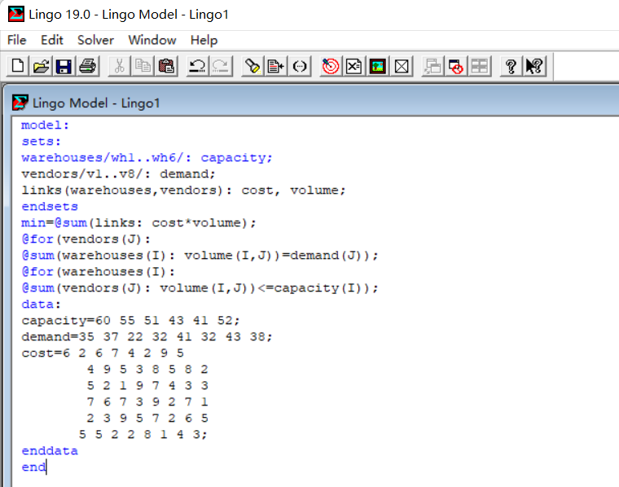

# LINGO 入门教程

## 写在前面

### 关于教程

关于这个 LINGO 教程的创作原因，是因为官方给出的标准教程竟然长达几百页，一些书/网页上的教程似乎对于想要入手 LINGO 的新手并不友好（我也看了很久wwww）

所以我重新整理了一下这些资料的排列顺序，用比较低专业度的语言重新描述，写一份相对友好的入门教程，希望能帮大家降低这个工具的使用门槛，同时也作为一个备忘录（因为同时在用很多门语言，忘掉语法了可以来看看hhh）

### 目录

采用一般编程语言的入门知识组织顺序构造了目录，如下：

0. 入门：LINGO 安装和界面介绍
1. LINGO 语言的数据类型和命名规则
2. LINGO 语言的函数对象及其调用方式

## 入门：LINGO 安装和界面介绍

LINGO 的安装非常简单，只需要到 LINDO（不是 LINGO ，这是开发 LINGO 产品的公司名称）的[官网（点击跳转）](https://lindo.com/index.php/ls-downloads/try-lingo)上下载对应的版本即可，他会让你填写一些基本信息，只要填写信息以后就会开始下载，理论上这是一款付费产品，但是即使不付费也可以使用 LINGO 的一些功能，对于我们来说只需要使用这些入门级别的功能就可以了，所以可以暂时不需要付费。

安装完成后就会看到 LINGO 的主界面，主界面相对来说比较简洁，大致可以分成一行图标和下面的编程区域（下面大片的空白就是编程区域）

这些图标的意思都相对容易理解：有查找、光标跳转、括号匹配、选项设置、帮助文档...比较重要的是那个靶心形状的图标，它相当于其他 IDE 中的编译运行，点击以后程序就会开始运转，然后解决我们在编程区中描述的模型问题。

一般情况下我们在空白区域用 LINGO 语言代码描述模型，然后点击 solve 图标解决问题，这就是使用 LINGO 的基本流程